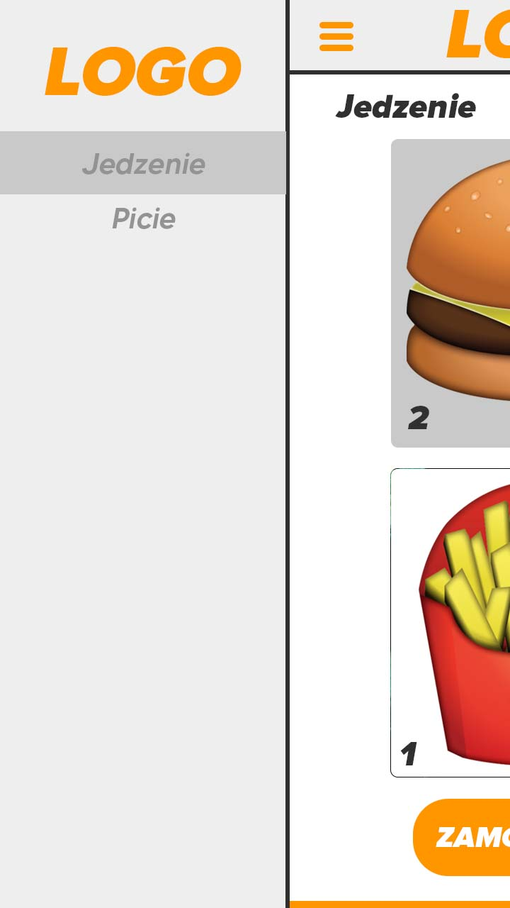
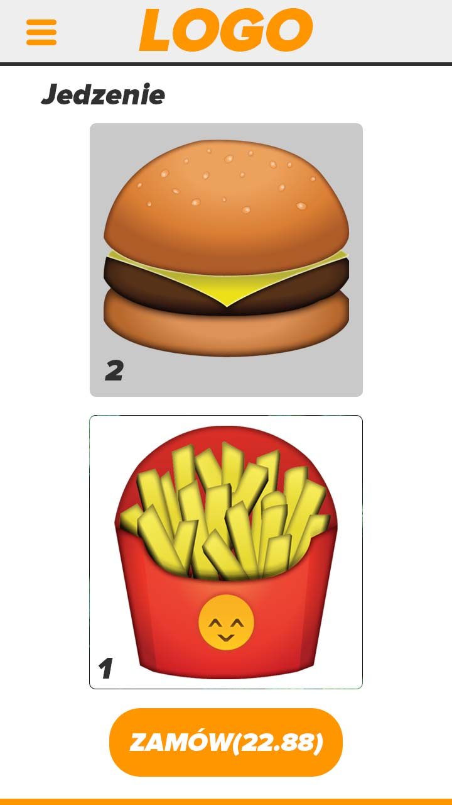

# Aplikacja Android WSB Burger

   ## Twórcy
 
 - Kamil Szewczyk,
 - Armin Ślęzak

   ## Opis Alplikacji
	
- v. 1.0
 
	Aplikacja ma za zadanie imitować aplikaje instalowane na kioskach w popularnych sieciach fast-foodowych tj.
	KFC, lub McDonald. Służy do szybkiego zamawiania jedzenia.

- v. 2.0 (planowana data wydania 1.01.2023) Przewidziane modyfikacje:
  - Dodanie bocznej belki, z wyborem Kategorii żywności(mock-up/bela.jpg)
  - Powiększenie Menu;
  - Poprawa szaty graficznej UI/UX;
  - Dodanie ikony aplikacji

	W przyszłości przewidziane są dodatkowe funkcje, które, które przyczynią się do rozwoju aplikacji

   ## Wymagana wersja Android
  
- Android 8.0 Oreo

  ## Link
  
  [DEMO](https://www.youtube.com/shorts/lNGGBK-OObM)
  
  ## Mock-Up
  
  
  
  
